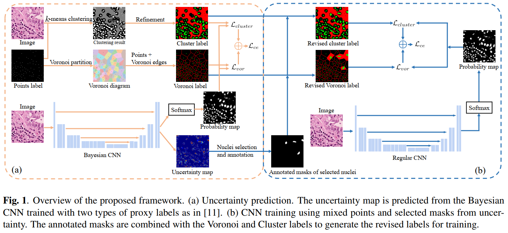

# Nuclei Segmentation with Mixed Points and Masks Selected from Uncertainty

This repository contains the pytorch code for the paper:

Nuclei segmentation using mixed points and masks selected from uncertainty, ISBI2020. ([PDF](http://paul.rutgers.edu/~hq43/resource/papers/ISBI2020_Hui.pdf))

If you find this code helpful, please cite our work:

```
@inproceedings{Qu2020nuclei,
    author = "Hui Qu, Jingru Yi, Qiaoying Huang, Pengxiang Wu, and Dimitris Metaxas",
    title = "Nuclei Segmentation Using Mixed Points and Masks Selected From Uncertainty",
    booktitle = "IEEE International Symposium on Biomedical Imaging, ISBI 2020",
    year = "2020",
}
```

## Introduction

Weakly supervised learning has drawn much attention to mitigate the manual effort of annotating pixel-level labels for 
segmentation tasks. In nuclei segmentation, point annotation has been successfully adopted for the training of deep 
learning models. However, points lack the shape information. Thus the segmentation of nuclei with non-uniform color is 
unsatisfactory. In this paper, we propose a framework of weakly supervised nuclei segmentation using mixed points and 
masks annotation. To save the extra annotation effort, we select typical nuclei to annotate masks from uncertainty map. 
Using Bayesian deep learning tools, we first train a model with points annotation to predict the uncertainty. Then we 
utilize the uncertainty map to select the representative hard nuclei for mask annotation automatically. The selected 
nuclear masks are combined with points to train a better segmentation model. Experimental results on two nuclei 
segmentation datasets prove that our method reduces the gap between segmentation performance in the weakly supervised 
setting and fully supervised setting while requiring a little extra annotation effort.



## Dependecies
Ubuntu 16.04

Pytorch 1.0

Python 3.6.6


## Usage


To training a model, set related parameters in the file `options.py` and run `python main.py`

To evaluate the trained model on the test set, set related parameters in the file `options.py` and 
run `python test.py`. You can also evaluate images without ground-truth labels by simply setting
`self.test['label_dir']=''` in the file `options.py` and run `python test.py`.
